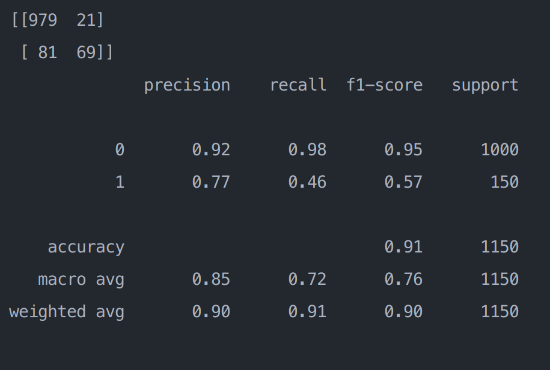

# [HW2] 人工智慧在異常偵測的應用 - Semi-supervised Anomaly Detection using AutoEncoders

## :one: Environment

1. python version: `3.9.12`
2. **[Optional]** Use python virtual environment:
    - 安裝 `virtualenv`:

    ```bash=
    pip3 install virtualenv
    ```

    - 建立 virtual environment （ex: anomaly-detect-hw2）

    ```bash=
    virtualenv anomaly-detect-hw2
    ```

    - activate virtual environment  （ex: anomaly-detect-hw2）

    ```bash=
     source anomaly-detect-hw2/bin/activate
    ```

3. Requirement Installation:

    :memo: file path: `requirements.txt`

    ```bash=
    pip3 install -r requirements
    ```

    NOTE: pytorch 版本是裝 
4. 備註：
    - Training 時：
      - GPU: `P100`
      - 

    - **(Inference)** 計算 F1-Score 時:
      - GPU: `GeForce RTX 3060`
      - 

## :two: Data Preparation

1. 使用助教已分好的 Class8:
    - :file_folder: data path: `TA-Class8`
2. 發現 `TA-Class8/Test/NonDefect` 只有 1149 張：

    - :arrow_right: 找出消失的那張放入 `TA-Class8/Test/NonDefect`
    - :memo: file path: `find_missing_image.py`

3.

## :three: Training

:memo: file path: `main.py`

```bash=
python main.py --train_dir TA-Class8/Train --val_dir TA-Class8/Test --epochs 50 --train_batch_size 8 --val_batch_size 8
```

1. 模型架構： 不變
2. 參數調整：
    - 將 `epoch` 調為 **50** (但其實蠻早 loss 就 = 0了)
    - `train_batch_size` & `val_batch_size` 都設為 8
3. 最終模型： :memo: file path: `./tensorboard_logs_08112023_14-14/best_model_13_loss=-1.5691627678387418e-05.pth`
    - loss: `-1.5691627678387418e-05`

## :four: 計算 F1-Score

:memo: file path: `calculate_f1_score.py`

:file_folder: 資料集： `TA-Class8/Test/NonDefect`

1. 總共設兩種 threshold：

| Value                    | Description                                                |
| ------------------------ | ---------------------------------------------------------- |
| 0.007                    | residual threshold (設定跟原作者一樣)                      |
| 133 （算法提供在第二點） | `residual.detach().cpu().numpy()` >  `0.007` 的element數量 |

2. 解釋：
    - 計算已確認有 Defect 的照片的 `residual.detach().cpu().numpy()` >  `0.007` 的element數量的平均
    - 步驟：
      - 1. 讀取原資料集的 `Labels.txt`
      - 2. 轉為 `Defect.txt`
      - 3. 將所有有 Defect 的 images 放入 `Test-Defect` 資料夾
      - 4. 將 `calculate_f1_score.py` 30-33 註解拿掉即可算出平均值 （大約 132.xxx，所以我設為 **133**)

3. 結果：
    - 用原作者的模型：
      - `model/best_model_25_loss=-2.150636353559904e-06.pth`
      - Confusion Matrix:
        - 
      - F1-Score
        - **0.95**
        - 
    - 自己的模型：
      - `./tensorboard_logs_08112023_14-14/best_model_13_loss=-1.5691627678387418e-05.pth`
      - Confusion Matrix:
        - 
      - F1-Score
        - **0.95**
        - 
